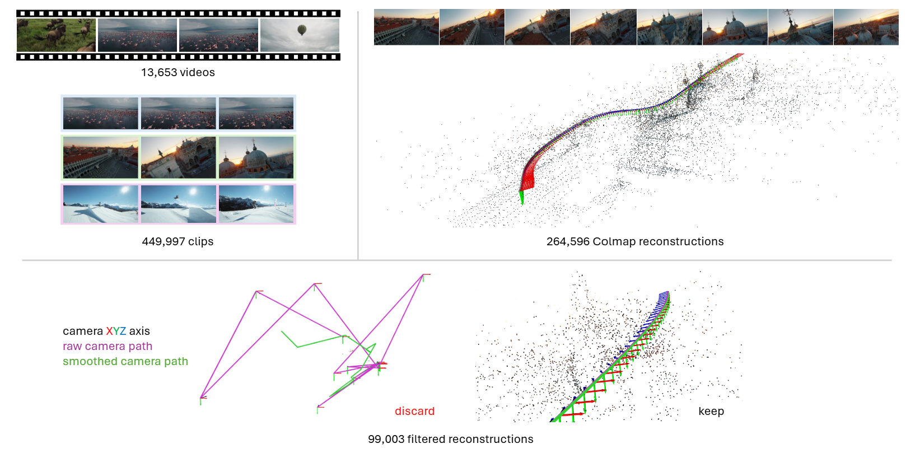
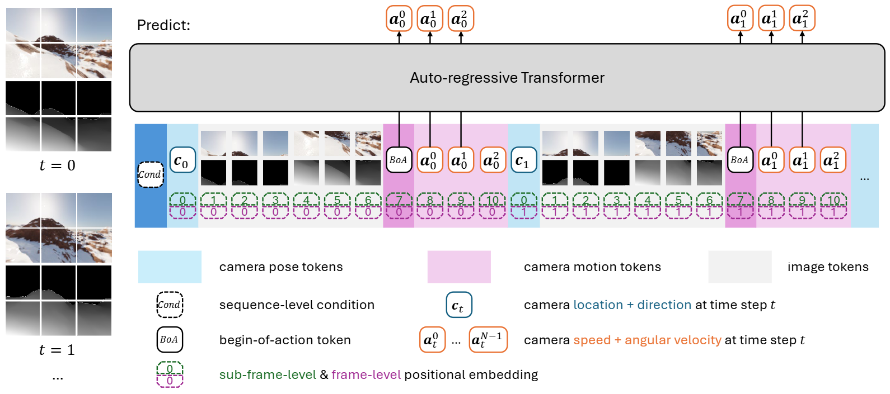

# DVGFormer: Learning Camera Movement Control from Real-World Drone Videos


<!-- <a href="https://arxiv.org/abs/2412.09620"></a>
<a href="https://dvgformer.github.io/"></a> -->
[**Paper**](https://arxiv.org/abs/2412.09620) | [**Project Page**](https://dvgformer.github.io/) | [**Data**](youtube_drone_videos/README.md) 

Official implementation of our paper: 
<br>**Learning Camera Movement Control from Real-World Drone Videos**<br>
[**Yunzhong Hou**](https://hou-yz.github.io/), [**Liang Zheng**](https://zheng-lab-anu.github.io/), [**Philip Torr**](https://eng.ox.ac.uk/people/philip-torr/)<br>

*"To record as is, not to create from scratch."*


Abstract: *This study seeks to automate camera movement control for filming existing subjects into attractive videos, contrasting with the creation of non-existent content by directly generating the pixels. We select drone videos as our test case due to their rich and challenging motion patterns, distinctive viewing angles, and precise controls. Existing AI videography methods struggle with limited appearance diversity in simulation training, high costs of recording expert operations, and difficulties in designing heuristic-based goals to cover all scenarios. To avoid these issues, we propose a scalable method that involves collecting real-world training data to improve diversity, extracting camera trajectories automatically to minimize annotation costs, and training an effective architecture that does not rely on heuristics. Specifically, we collect 99k high-quality trajectories by running 3D reconstruction on online videos, connecting camera poses from consecutive frames to formulate 3D camera paths, and using Kalman filter to identify and remove low-quality data. Moreover, we introduce DVGFormer, an auto-regressive transformer that leverages the camera path and images from all past frames to predict camera movement in the next frame. We evaluate our system across 38 synthetic natural scenes and 7 real city 3D scans. We show that our system effectively learns to perform challenging camera movements such as navigating through obstacles, maintaining low altitude to increase perceived speed, and orbiting tower and buildings, which are very useful for recording high-quality videos.*


<!-- ## Data Overview

For scraped YouTube videos, we run shot change detection to split the videos into clips of individual scenes (*top left*). We then use Colmap to reconstruct the 3D scene and recover camera poses from video frames (*top right*). Finally, we connect camera poses from consecutive frames to formulate 3D camera trajectories and apply a Kalman filter to discard low-quality reconstructions where camera poses from neighboring frames are drastically different (*bottom*).


## Method Overview

To predict camera motion *a<sub>t</sub>* for time step *t*, the auto-regressive architecture uses as input a long horizon with camera poses *{c<sub>0</sub>, ..., c<sub>t</sub>}*, motion *{a<sub>0</sub>, ..., a<sub>t-1</sub>}*, images *{x<sub>0</sub>, ..., x<sub>t</sub>}*, and their monocular depth estimations from all previous frames. Each action *a<sub>t</sub>* is broken into *N* intermediate steps *{a<sub>t</sub><sup>0</sup>, ..., a<sub>t</sub><sup>N-1</sup>}* between time step *t* and *t+1*. -->

## Project Updates

- 🔥🔥 News: ```2024/12/13```: We have released the [DroneMotion-99k dataset](youtube_drone_videos/README.md). Check out the README file for the steps needed after downloading the HDF5 archieve. 
- 🔥🔥 News: ```2024/12/13```: We have released the the [code](https://github.com/hou-yz/dvgformer) for the DVGFormer!
- 🔥🔥 News: ```2024/12/13```: Our [paper](https://arxiv.org/abs/2412.09620) is now online!

## Todo List
- [x] Initialize repo
- [x] Code release
- [x] Blender scene files for evaluation
- [x] DroneMotion-99k dataset
    - [x] HDF5 archieve of filtered 3D camera trajectories
    - [x] scripts for downloading the corresponding YouTube videos
- [ ] Release model checkpoints

## Model Checkpoint
Coming soon!

## Installation
1. **Create and activate a Conda environment**:
    ```sh
    conda create -n dvgformer python=3.10
    conda activate dvgformer
    conda install pytorch==2.4.1 torchvision==0.19.1 torchaudio==2.4.1 pytorch-cuda=12.1 -c pytorch -c nvidia
    conda install -c conda-forge ffmpeg
    pip install -r requirements.txt
    ```

2. **Download evaluation data**
   
    For real city 3D scans from Google Earth, please download from this [link](https://1drv.ms/f/c/dfb1b9d32643ecdc/EhrvMtW9ow5KrpfPJlAnJ9wBjaaYqNEKx98NOXGFteJ3pg?e=d99AG4).

    For synthetic natural scenes, you can either generate your own version from the official git repo [princeton-vl/infinigen](https://github.com/princeton-vl/infinigen) or directly download from this [link](https://1drv.ms/f/c/dfb1b9d32643ecdc/EgQWiB64W6dCsuOko_UoNQoB9Zj4cb-SSlqLFdVZITJT7Q?e=MBvCGx). Note that our version has very basic graphic settings and you might need to generate your own version if you need higher graphics. 

    After downloading the evaluation environments, your folder should look like this
    ```
    dvgformer/
    ├── infinigen/
    │   ├── arctic/
    │   ...
    │   └── snowy_mountain/
    ├── blosm/
    │   ├── himeji/
    │   ...
    │   └── sydney/
    ├── src/
    ├── README.md
    ...
    ```

3. **Download training data**
   
    We provide the Colmap 3D reconstruction results and the filtered camera movement sequences in our DroneMotion-99k dataset. You can download either a minimal dataset with 10 videos and 129 sequences [link](https://1drv.ms/u/c/dfb1b9d32643ecdc/ERIEM1bBgvVHtqgyN4T-7qoBmiHYaHcAdUUz5McREVuI_w?e=qwOBge) or the full dataset with 13,653 videos and 99,003 camera trajectories [link](https://1drv.ms/u/c/dfb1b9d32643ecdc/EcHhl1KtZrdHn4wkDJ9Kcg4BtwQCP3f3hKUHS7PArhprnw?e=SRkFjl). 

    After downloading the training data, your folder should look like this
    ```
    dvgformer/
    ├── youtube_drone_videos/
    │   ├── dataset_full.h5
    │   └── dataset_mini.h5
    ├── src/
    ├── README.md
    ...
    ```

    Due to the YouTube policy, we cannot share the video MP4s or the frames. As an alternative, we include a python script `download_videos.py` that can help you automatically download the videos and extract the frames. 
    ```python
    python download_videos.py --hdf5_fpath youtube_drone_videos/dataset_mini.h5
    python download_videos.py --hdf5_fpath youtube_drone_videos/dataset_full.h5
    ```
    This should update your downloaded HDF5 dataset file with the video frames. 

    You can also adjust the number of workers for the download process or the frame extraction process in `download_videos.py` by specifying `--num_download_workers` or `--num_extract_workers`.


## Running DVGFormer Model
1. **Inference**:
    You can download the model checkpoint from this [link (coming soon)]().
    ```sh
    python blender_eval.py 
    ```

2. **Train your own model**:
    We use two RTX 3090 in our experiments. Please run the following script for training your own model.
    ```sh
    bash run_gpu01.sh
    ```


## Citation
Please cite our paper:
```
@article{hou2024dvgformer,
  author    = {Hou, Yunzhong and Zheng, Liang and Torr, Philip},
  title     = {Learning Camera Movement Control from Real-World Drone Videos},
  journal   = {arXiv preprint},
  year      = {2024},
}
```

